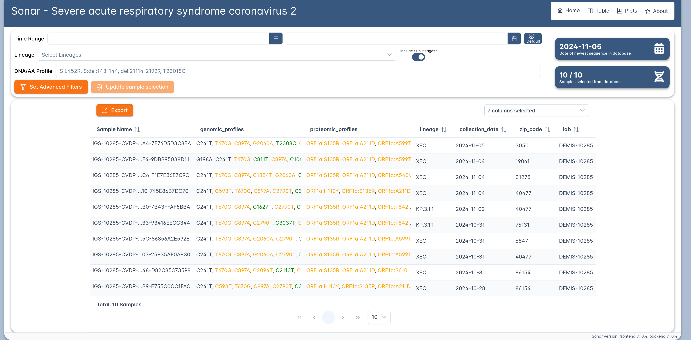
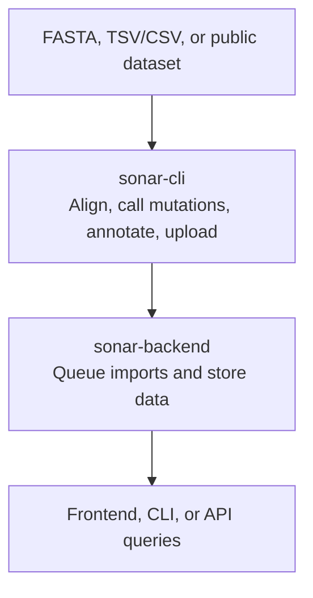

# Sonar

Sonar is an open-source system for pathogen genomic surveillance. It helps teams
turn consensus sequences and metadata into searchable mutation profiles, then
query and visualize those data across one or more pathogens.

Sonar is designed for groups that need to:

- store genome sequences, mutations, annotations, and sample metadata together
- add new pathogen references without changing application code
- import large FASTA, TSV, CSV, or public dataset inputs through a repeatable CLI workflow
- search samples by mutation profile, lineage, collection date, or custom metadata
- explore filtered datasets in a web interface with tables, exports, and charts



## How Sonar Works

Sonar has three user-facing parts:

| Component | What it does | Documentation |
| --- | --- | --- |
| `sonar-cli` | Adds references, imports sequences and metadata, queries the database, and runs preprocessing such as alignment and annotation. | [CLI README](./apps/cli/README.md) |
| `sonar-backend` | Stores references, samples, metadata, mutations, annotations, and import jobs behind an HTTP API. | [Backend README](./apps/backend/README.md) |
| `sonar-frontend` | Lets users browse, filter, export, and visualize data in a web browser. | [Frontend README](./apps/frontend/README.md) |

Typical data flow:



The backend and frontend are normally deployed with prebuilt Docker images. The
CLI can be run from its Docker image as well, which is the recommended path for
users who only need to operate Sonar rather than develop it.

## Quick Start With Docker

The fastest way to try Sonar is the Docker Compose deployment bundle from
[GitHub Releases](https://github.com/rki-mf1/sonar/releases). It starts the
backend, frontend, database, worker, and cache from prebuilt Docker images.

Requirements:

- Docker Engine with the Docker Compose plugin
- `curl`
- `python3`

```sh
curl -LO https://github.com/rki-mf1/sonar/releases/latest/download/sonar-docker-deploy-bundle.tar.gz
tar -xzf sonar-docker-deploy-bundle.tar.gz
cd example-deploy
./bootstrap.sh --tag latest
```

The bootstrap script creates local config files when needed, generates local
secret defaults, pulls the Docker images, starts the stack, downloads example
datasets, and imports small SARS-CoV-2 and Mpox examples.

After startup:

| Service | Default URL |
| --- | --- |
| Web frontend | `http://localhost:18080` |
| Backend API | `http://localhost:18000/api/` |

For manual setup, configuration, ports, secrets, image tags, and CLI helper
usage, see the `README.md` included in the extracted deployment bundle.

## First Workflow

Once Sonar is running, a typical workflow is:

1. Add a GenBank reference genome.
2. Import FASTA sequences and metadata with `sonar-cli`.
3. Track the backend import job.
4. Query samples from the CLI or explore them in the web frontend.

Example using the deployment bundle helper:

```sh
cd example-deploy

./sonar-cli.sh reference add --genbank /data/sars-cov-2/MN908947.nextclade.gb

./sonar-cli.sh sample import \
  -r MN908947.3 \
  --auto-anno \
  --fasta /data/sars-cov-2/SARS-CoV-2_12.fasta.xz \
  --tsv /data/sars-cov-2/SARS-CoV-2_12.tsv.xz \
  --cols name=name lineage=lineage collection_date=collection_date

./sonar-cli.sh sample match -r MN908947.3 --count
```

See the [CLI README](./apps/cli/README.md) for reference import, sample import,
metadata mapping, public dataset import, and query examples.

## Documentation

- [Docker deployment guide](./example-deploy/README.md) (also included as `README.md` in the [release](https://github.com/rki-mf1/sonar/releases) deployment bundle)
- [CLI user guide](./apps/cli/README.md)
- [Backend operator guide](./apps/backend/README.md)
- [Frontend user guide](./apps/frontend/README.md)
- [Contributing](./CONTRIBUTING.md)

Developer setup, source-based installation, tests, formatting, releases, and
component internals live in [CONTRIBUTING.md](./CONTRIBUTING.md) and the
component-specific CONTRIBUTING files linked from there.

## Published Docker Images

- `ghcr.io/rki-mf1/sonar-backend`
- `ghcr.io/rki-mf1/sonar-frontend`
- `ghcr.io/rki-mf1/sonar-cli`

Use a fixed release tag for production deployments. Use `latest` only for a
trial or when you intentionally want the newest published build.

## License

Sonar is licensed under the GNU Affero General Public License. See
[LICENSE.txt](./LICENSE.txt).

Third-party software is licensed under its own licenses. See
[THIRD-PARTY-LICENSES.txt](./THIRD-PARTY-LICENSES.txt).

## Acknowledgments

Sonar has been developed as part of:

- DAKI-FWS, Daten- und KI-gestütztes Frühwarnsystem zur Stabilisierung der deutschen Wirtschaft, funded by the Bundesministerium für Wirtschaft und Klimaschutz
- HERA, Health Emergency Preparedness and Response Authority, funded by the European Commission

We also acknowledge the support of the Hasso Plattner Institute and the work of
all Sonar contributors.
